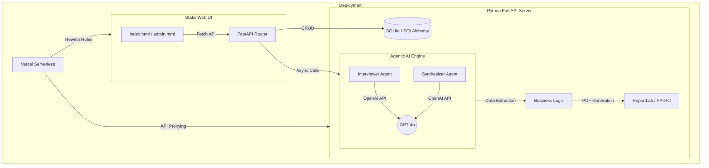

# 🌌 Aria: AI-Powered Pain Point Mapper

Aria is a sophisticated, agentic AI platform designed to transform raw customer feedback into structured strategic insights. It uses autonomous agents to conduct dynamic "interviews" with users, extracting deep qualitative pain points and synthesizing them into actionable reports.

---

## 🏗️ Detailed Architecture

Aria follows a decoupled, asynchronous architecture optimized for high-concurrency LLM operations.

### System Overview (Mermaid Diagram)



### Core Components

#### 1. **Frontend Layer**
- **Vanilla JS & CSS**: High-performance, lightweight interface for low-latency feedback collection.
- **Dynamic Interview Portal**: An interactive flow that guides users through semantic "pain discovery."

#### 2. **Agentic AI Layer**
- **Interviewer Agent (`backend/agents/interviewer.py`)**: A context-aware agent that probes for deeper customer frustrations based on initial responses.
- **Synthesizer Agent (`backend/agents/synthesizer.py`)**: Aggregates disparate feedback bits into unified "Pain Categories" and "Strategic Opportunities."

#### 3. **API & Orchestration (FastAPI)**
- **Fully Asynchronous**: Built on `asyncio` to handle multiple simultaneous AI conversations without blocking.
- **SQLAlchemy 2.0**: Uses `aiosqlite` for non-blocking database transactions.

#### 4. **Document Studio**
- **Automated Reporting**: Generates high-fidelity PDF "decks" or reports using `reportlab`, ready for stakeholder presentation.

---

## 📂 Project Structure

```text
/
├── frontend/             # Optimized Static Web Assets
│   ├── index.html        # Customer Portal
│   └── admin.html        # Admin Dashboard
├── backend/              # Python Intelligence Layer
│   ├── agents/           # LLM Orchestration Logic
│   ├── api/              # RESTful API Endpoints (/api/v1)
│   ├── core/             # DB & Config Initializers
│   ├── models/           # SQLAlchemy ORM Schemas
│   └── main.py           # Application Gateway
├── vercel.json           # Cloud Deployment Configuration
└── .env                  # (Git Ignored) OpenAI API Credentials
```

---

## 🚀 Getting Started

### Prerequisites
- Python 3.10+
- OpenAI API Key

### Local Setup
1. **Clone the repository:**
   ```bash
   git clone https://github.com/sumankhalia85-coder/aria.git
   cd aria
   ```

2. **Backend Setup:**
   ```bash
   cd backend
   python -m venv venv
   source venv/bin/activate  # Windows: venv\Scripts\activate
   pip install -r requirements.txt
   ```

3. **Environment Configuration:**
   Create a `.env` file in `/backend`:
   ```env
   OPENAI_API_KEY=your_key_here
   DATABASE_URL=sqlite+aiosqlite:///pain_mapper.db
   ```

4. **Run the Application:**
   ```bash
   uvicorn main:app --reload
   ```

---

## ☁️ Deployment

The project is **Vercel-ready**. Simply push this repository to Vercel, and the `vercel.json` will automatically handle the routing between the static frontend and the serverless python backend.

---

## 📄 License
MIT License - Created by [sumankhalia](https://github.com/sumankhalia85-coder)
